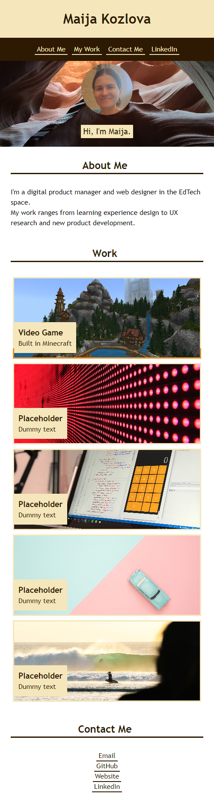

# My Portfolio Website

## Description

This is a code for my [Portfolio Website](https://maijako.github.io/maijako-portfolio) to showcase my skills and projects as a web developer.

It was built to fit wider and smaller screens by implementing responsive design elements, such as:

+ Flexbox
+ CSS Grid
+ Media query 

Allowing the application to render as follows on wider screens:

And on smaller screens:

## Usage

The website as of today can be used as an example of organizing a personal portfolio.

It will be used to showcase my work and projects as a developer. 

## Credits

The source code and the original asset files were provided by [Trilogy Education](https://2u.com/) as part of the Front End Web Development bootcamp sponsored by the [Skills For Life](https://skillsforlife.edx.org/) program.

The hero images are my own, photographed in [Antelope Canyon, AZ](https://www.antelopecanyon.com/), and [Ein Gedi](https://en.wikipedia.org/wiki/Ein_Gedi) in Israel.

The image showcasing my development work on [Adventures in English with Cambridge](https://education.minecraft.net/en-us/lessons/english-adventures) belong to [Cambridge University Press & Assessment](https://www.cambridge.org/).

## Licence

This code uses MIT License.

